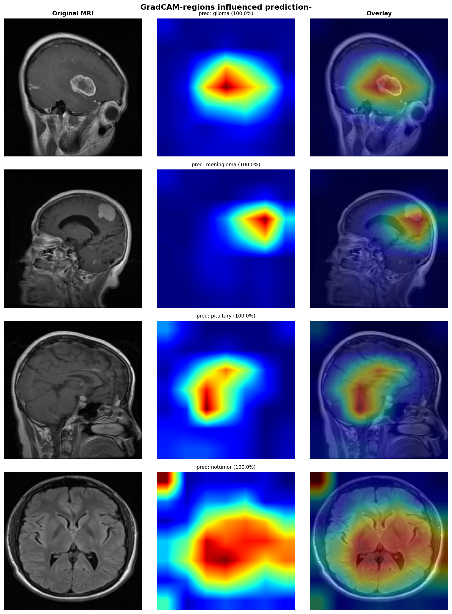

# Brain Tumor MRI Classification
### EfficientNet-B3 fine-tuning with GradCAM explainability


## Overview

A deep learning pipeline for classifying brain MRI scans into 4 categories: **glioma, meningioma, pituitary tumor, and no tumor**. The project demonstrates the real-world impact of transfer learning over training from scratch on medical imaging data, supported by GradCAM explainability to validate that the model attends to clinically relevant brain regions.

## Results

| Model | Val Accuracy | Test Accuracy | Parameters |
|-------|-------------|---------------|------------|
| Baseline CNN (from scratch) | ~90% | ~88% | 422K |
| EfficientNet-B3 (fine-tuned) | ~97% | **~98%** | 12.2M |

**Transfer learning improved test accuracy by ~+10% over the from-scratch baseline.**

## GradCAM Explainability



GradCAM visualizes which regions of the MRI scan most influenced each prediction:

| Class | Model Attention |
|-------|----------------|
| **Glioma** | Activation centered directly on the visible tumor mass in the upper brain |
| **Meningioma** | Tight focus on the posterior meningeal boundary — anatomically correct localization |
| **Pituitary** | Attention concentrated in the lower-center region — exactly where the pituitary gland sits |
| **No tumor** | Broad diffuse activation with no focal hotspot — the expected and correct behavior for a healthy scan |

All four cases confirm the model attends to clinically relevant regions rather than background artifacts — a critical requirement for clinical trustworthiness.

## Dataset

- **Source:** [Kaggle — Brain Tumor MRI Dataset](https://www.kaggle.com/datasets/masoudnickparvar/brain-tumor-mri-dataset)
- **Classes:** glioma, meningioma, pituitary, notumor (4 classes)
- **Split:** 70% train / 15% val / 15% test (stratified by class)
- **Preprocessing:** Resize to 224×224, ImageNet normalization
- **Augmentation (train only):** Random horizontal flip, ±15° rotation, brightness/contrast jitter

## Project Structure

```
brain-tumor-mri-classification/
├── src/
│   ├── dataset.py        # BrainTumorDataset — custom PyTorch Dataset class
│   ├── models.py         # BrainTumorCNN — baseline CNN architecture
│   ├── efficientnet.py   # EfficientNetClassifier — EfficientNet-B3 fine-tuning
│   ├── train.py          # Training loop, dataloaders, evaluation, plotting
│   └── gradcam.py        # GradCAM implementation + visualization
├── results/
│   ├── eda_sample_images.png
│   ├── eda_distribution_splits.png
│   ├── eda_augmentation.png
│   ├── baseline_training_curves.png
│   ├── efficientnet_confusion_matrix.png
│   └── gradcam_results.png
├── brain_tumor_mri_classification.ipynb
└── README.md
```

## Architecture

### Baseline CNN (from scratch)
Built entirely from scratch to establish a performance baseline before transfer learning.

```
Input [3, 224, 224]
  → ConvBlock(3  → 32)   # Conv2d → BatchNorm2d → ReLU → MaxPool2d
  → ConvBlock(32 → 64)
  → ConvBlock(64 → 128)
  → ConvBlock(128 → 256)
  → AdaptiveAvgPool2d(1)  # Global Average Pooling
  → Linear(256 → 128) → ReLU → Dropout(0.5)
  → Linear(128 → 4)
Output: [4 logits]
```
- **Total parameters:** ~422K
- **Regularization:** Dropout(0.5) + weight_decay=1e-4

### EfficientNet-B3 (Transfer Learning)
Pre-trained on ImageNet (1.2M images). The original 1000-class head is replaced with a custom 4-class classifier.

```
EfficientNet-B3 backbone (pretrained, ImageNet)
  → Custom classifier head:
     Dropout(0.4) → Linear(1536 → 256) → ReLU → Dropout(0.4) → Linear(256 → 4)
```
- **Total parameters:** ~12.2M

**Two-phase fine-tuning strategy:**

| Phase | Layers Trained | Learning Rate | Epochs |
|-------|---------------|---------------|--------|
| Phase 1 | Classifier head only (backbone frozen) | 1e-3 | 10 |
| Phase 2 | Head + top 3 backbone blocks unfrozen | 1e-4 | 15 |

## Key Design Decisions

**Why two-phase fine-tuning?**
Training all 12M parameters from the start with a high learning rate causes *catastrophic forgetting* — the pretrained ImageNet weights get destroyed in the first few batches. Phase 1 stabilizes the new head before Phase 2 carefully adapts the backbone at a much lower learning rate.

**Why Global Average Pooling instead of Flatten?**
GAP reduces each feature map to a single value, drastically reducing parameters (256 vs. 256×14×14 = 50K) and acting as built-in regularization against overfitting.

**Why GradCAM on the last convolutional layer?**
The last conv layer contains the most semantically rich feature maps — they directly influence the classification decision while still retaining spatial information needed to localize the tumor region.

**Why recall over precision for medical imaging?**
A false negative (missed tumor) is clinically more dangerous than a false positive (unnecessary follow-up). Prioritizing recall ensures the model errs on the side of caution.

**Why less dropout (0.4) on EfficientNet vs baseline (0.5)?**
EfficientNet already has built-in regularization — BatchNorm throughout the backbone and a well-initialized set of pretrained weights. Adding too much dropout on top would cause underfitting.

## How to Run

### 1. Clone and install dependencies
```bash
git clone https://github.com/ersandenizhanzorlutuna-cpu/brain-tumor-mri-classification.git
cd brain-tumor-mri-classification
pip install torch torchvision scikit-learn matplotlib seaborn opencv-python pillow
```

### 2. Download the dataset
```bash
kaggle datasets download -d masoudnickparvar/brain-tumor-mri-dataset -p data/
unzip data/brain-tumor-mri-dataset.zip -d data/
```

### 3. Run in Google Colab
Open `brain_tumor_mri_classification.ipynb` in Google Colab with a T4 GPU runtime. The notebook is fully self-contained and runs end-to-end.

Estimated runtimes on T4 GPU:
- EfficientNet Phase 1 (10 epochs): ~8 min
- EfficientNet Phase 2 (15 epochs): ~12 min

## Requirements

```
torch >= 2.0
torchvision >= 0.15
scikit-learn
matplotlib
seaborn
opencv-python
Pillow
numpy
kaggle
```
